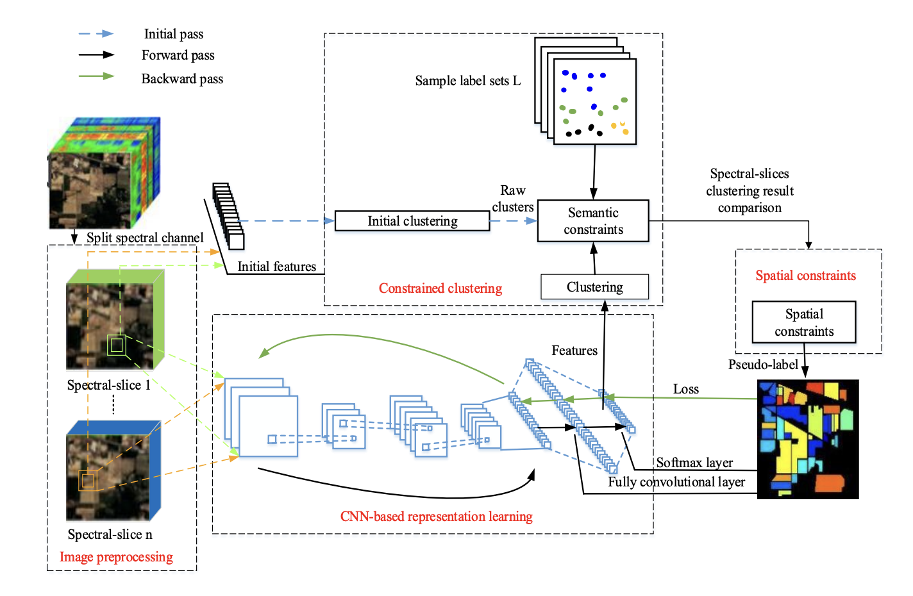

# Spatial-Regulated Self-Training

Code implementation of [Semi-Supervised Hyperspectral Image Classification via Spatial-Regulated Self-Training](https://www.mdpi.com/2072-4292/12/1/159) paper.



## Notebooks

* [EDA for Indian Pines](notebooks/0-00-eda.ipynb)
* [Create train dataset for Indian Pines](notebooks/0-01-select-train-ds.ipynb)
* [Indian Pines classification with LeNet](notebooks/1-00-lenet.ipynb)
* [Indian Pines classification with ViT](notebooks/1-01-vit.ipynb)
* [Indian Pines classification with SpectralFormer](notebooks/1-02-spectral-former.ipynb)
* [Indian Pines classification with FactoFormer](notebooks/1-03-facto-former.ipynb)
* [Indian Pines classification with GSViT](notebooks/1-04-gsvit.ipynb)
* [Indian Pines classification with DBDA](notebooks/1-05-dbda.ipynb)
* [Indian Pines classification with SSFTTNET](notebooks/1-06-ssfttnet.ipynb)
* [Indian Pines classification with FDSSC](notebooks/1-07-fdssc.ipynb)
* [Indian Pines classification with SSRN](notebooks/1-08-ssrn.ipynb)
* [Indian Pines classification with DCTN](notebooks/1-09-dctn.ipynb)
* [Indian Pines classification with modified DBDA (fusion by cross attention)](notebooks/1-10-dbda-v2.ipynb)
* [Indian Pines ground classification with LeNet](notebooks/2-00-ground-lenet.ipynb)
* [Indian Pines bin classification with LeNet](notebooks/2-01-bin-lenet.ipynb)
* [Indian Pines ground classification with GSViT](notebooks/2-04-ground-gsvit.ipynb)
* [Indian Pines bin classification with DBDA](notebooks/2-05-bin-dbda.ipynb)
* [Indian Pines ground classification with DBDA](notebooks/2-06-ground-dbda.ipynb)
* [Indian Pines classification with original spatial regulated self trainining](notebooks/3-00-v1-spatial-regulated-self-training.ipynb)
* [Indian Pines classification with modified spatial regulated self trainining](notebooks/3-01-v2-spatial-regulated-self-training.ipynb)
* [Grid hyperparam search for original spatial regulated self trainining](notebooks/4-00-v1-spatial-regulated-self-training-gridsearch.ipynb)
* [Grid hyperparam search for modified spatial regulated self trainining](notebooks/4-01-v2-spatial-regulated-self-training-gridsearch.ipynb)
* [Grreed hyperparam search for original spatial regulated self trainining](notebooks/4-02-v1-spatial-regulated-self-training-greedsearch.ipynb)
* [Pointwise autoencoder](notebooks/5-00-pointwise-autoencoder.ipynb)
* [Spatial autoencoder](notebooks/5-01-spatial-autoencoder.ipynb)
* [ViT autoencoder](notebooks/5-02-vit-autoencoder.ipynb)
* [Indian Pines classification with clustering](notebooks/6-00-idian-pines-clustering.ipynb)
* [Indian Pines classification with SpectralFormer and co-training](notebooks/6-01-sf-co-training-indian-pines.ipynb)
* [Indian Pines classification with LeNet and co-training](notebooks/6-02-cnn-co-training-indian-pines.ipynb)
* [Indian Pines classification with label propagation](notebooks/6-03-lenet-label-propagation.ipynb)
* [Indian Pines classification with democratic co-learning](notebooks/6-04-democratic-co-learning.ipynb)
* [Indian Pines classification with bin multiview training](notebooks/6-05-multiview-training-indian-pines.ipynb)
* [Indian Pines classification with positive unlabled multiview training](notebooks/6-06-pu-multiview-training-indian-pines.ipynb)

## Description

Because there are many unlabeled samples in hyperspectral images and the cost of manual labeling is high, this algorithm adopts semi-supervised learning method to make full use of many unlabeled samples.

### Iterative Hyperspectral Image Classification Process
1. Spectral-Slicing:
    * Divide the hyperspectral image into four spectral-slices based on spectral channels.
    * Each slice contains 1/slice_count of the original spectral channels.
2. Raw Feature Extraction:
    * Extract raw features $X_0 = \{X^1_{0}, X^2_{0}, ..., X^n_{0}\}$ from each spectral-slice.
    * Each feature is obtained by flattening a 5×5 sample patch centered on the sample.
3. Over-Clustering:
    * Perform separate over-clustering on each spectral-slice to get clusters $K_0 = \{K^1_{0}, K^2_{0}, ..., K^n_{0}\}$.
4. Semantic Constraint Application:
    * Apply semantic constraints using the initial labels L.
    * Identify consistent cluster assignments across slices to form semantic clusters C<sub>0</sub>.
5. Spatial Constraint Application:
    * Use spatial consistency to refine C<sub>0</sub> and obtain the initial classification result Y<sub>0</sub>.
6. CNN Retraining (Iterative):
    * Retrain the CNN using updated Y<sub>t - 1</sub>  and input data.
7. CNN Feature Extraction (Iterative):
    * In each iteration t, extract feature set $X_t = \{X^1_{t}, X^2_{t}, ..., X^n_{t}\}$ from CNN’s fully convolutional layers.
    * Use 9×9 sample patches for feature encoding.
3. Over-Clustering:
    * Choose cluster size to be smaller then on previous iteration.
    * Perform over-clustering on each spectral-sliced feature set to get clusters $K_t = \{K^1_{t}, K^2_{t}, ..., K^n_{t}\}$.
8. Constrained Clustering and Classification (Iterative):
    * Repeat constrained clustering and spatial constraint steps to generate updated classification result Y<sub>t</sub>.
10.	Stopping Condition:
    * Repeat steps 6-8 num_epochs while K > K<sup>\*</sup>. Where K current number of clusters and K<sup>\*</sup> is an input parameter typically set to 2 * num_classes.

### Semantic Constraint
1. Label Count per Cluster (Sᵢ):
    * For each cluster i, count how many labeled samples it contains.
    * pt(i, j, q) is an indicator function that returns 1 if the j-th sample in cluster i has label q ≠ 0 (not background), and 0 otherwise.
    * $S_i = \sum_{q=1}^{K} \sum_{j=1}^{N_{p,i}} pt(i, j, q)$
2. Average Number of Labels per Cluster (Sₐᵥₑ):
    * Compute the average number of labeled samples across all clusters.
    * $S_{ave} = \frac{\sum S_i}{N_c}$
3. Label Purity in Cluster (PUREᵢ,𝒇):
    * For each label f in cluster i, calculate its purity as the proportion of samples in that cluster having label f.
    * $PURE_{i, f} = \frac{\sum_{j=1}^{N_{p,i}} pt(i, j, f)}{S_i}, \quad f \in \{1, 2, …, K\}$
4.	Maximum Purity & Thresholding:
    * Compute the maximum purity PUREᵢ,𝚖ₐₓ over all labels f in cluster i.
    * If:
    * PUREᵢ,𝚖ₐₓ > threshold TH (typically 50%–80%)
    * and Sᵢ > Sₐᵥₑ
    * → Then, the cluster is assigned to label f with high confidence.
5. Slice Agreement:
    * Finally, only samples that are assigned to the same class across all spectral slices are retained as confident results for the over-clustering process.

### Spatial Constraint

1. Purpose:
    * Improve the reliability of pseudo labels by leveraging spatial coherence — neighboring pixels in hyperspectral images are likely to belong to the same class.
2. Local Decision Strategy:
    * For each unlabeled sample, examine a square neighborhood around it.
    * Count labeled samples by class in two concentric regions:
    * First circle (inner ring): 8 immediate neighbors.
    * Second circle (outer ring): 16 next-closest neighbors.
    * Assign weights to samples based on their proximity:
    * w1 for first circle (closer samples).
    * w2 for second circle (further samples).
3.	Score Calculation:
    * For each class i, compute the score using: $S_{L_i} = w1 \times N_{L_i,1} + w2 \times N_{L_i,2}$
    * Where:
        * $N_{L_i,1}$: Number of labeled samples of class i in the first circle.
        * $N_{L_i,2}$: Number in the second circle.
        * w1 = 1, w2 = 0.5 (used in the experiment).
4. Label Assignment:
    * The class with the highest score is selected as the predicted label.
5. Confidence Thresholding:
    * Use a threshold value $\text{ThreshHold} = 8$.
    * If the score for class L1 exceeds the threshold, sample point P is confidently assigned to L1.

### Pseudocode
```python
Input: HSI_image, num_slices, L, K_star, K
spectral_slices = split_spectral_slices(HSI_image, num_slices)

X1 = []
for slice in spectral_slices:
    features = extract_patch_features(slice, patch_size=5)
    X1.append(features)

K0 = []
for features in X1:
    clusters = over_cluster(K, features)
    K0.append(clusters)

C0 = apply_semantic_constraints(K0, L)

Y0 = apply_spatial_constraint(C0)

K = get_next_number_of_clusters(K)

Y_t = Y0
while K > K_star:
    train_cnn(input_data=HSI_image, labels=Y_t)

    X_t = []
    for slice in spectral_slices:
        features = cnn_extract_features(slice, patch_size=9, iteration=t)
        X_t.append(features)

    K_t = []
    for features in X_t:
        clusters = over_cluster(K, features)
        K_t.append(clusters)

    C_t = apply_semantic_constraints(K_t, L)
    Y_t = apply_spatial_constraint(C_t)

    K = get_next_number_of_clusters(K)

Output: Final classification result Y_t
```
